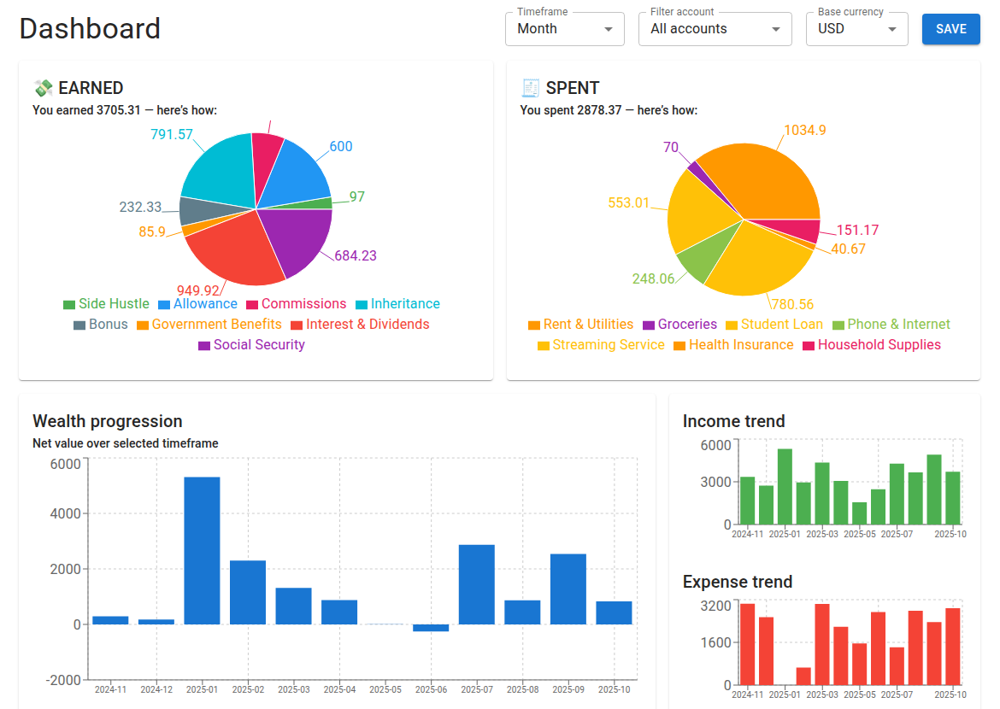

# finance-dashboard
💰 Personal Finance Dashboard: Track income, expenses, savings, and investments with charts and multi-currency support

## This project is hosted online via Vercel: [AVAILABLE HERE](https://finance-dashboard-hub.vercel.app/)

Note: This online version is fetched from the main branch of the repo while the local access is on the `local-dev` branch, this is due to conflicting config files and variables, but all the features should be the same

## Requirements (local access)

This project has a backend (Python/FastAPI) and a frontend (React). Before running the project, make sure you have the following installed and configured.

### Clone the repository
    $ git clone -b local-dev --single-branch git@github.com:JadBghiel/finance-dashboard.git

### System
- macOS, Linux, or Windows (Windows Subsystem for Linux recommended)

### Python (backend)
- Python 3.8 or newer
- Virtual environment tool (venv, virtualenv, or similar)

Python dependencies (stored in dashboard/backend/requirements.txt):

    - fastapi
    - uvicorn[standard]
    - sqlalchemy
    - python-dotenv
    - alembic
    - pydantic[email]
    - requests
    - psycopg2-binary

Install backend dependencies:

### From project root
    $ python -m venv .venv
### macOS / Linux
    $ source .venv/bin/activate
### Windows (PowerShell)
    $ .venv\Scripts\Activate.ps1
### Install the dependencies
    pip install -r dashboard/backend/requirements.txt

## LAUNCH
In the root of the project:

    $ ./run.sh

This script will automatically:
- Create a Python virtual environment (if needed)
- Install all backend dependencies
- Start the FastAPI backend server
- Start the React frontend

## FEATURES IMPLEMENTED
- Dashboard page:
    - Shows pie charts of income and expense, the total net liquidation value, the breakdown of each category and each account
- Income page:
    - Add, delete, edit, search and sort any entry
- Expense page
    - Add, delete, edit, search and sort any entry
- Account page
    - Add, delete and edit any entry
- Category page
    - Add, delete and edit any entry
- Investment page:
    - Shows portfolio
    - Add, delete or edit any investement
    - Create and view your watchlist
    - View any available financial instrument (Yahoo Finance API)
- Dark mode toggleable
- Export data to CSV/SQL/PDF

## GENERATE ENTRIES (local and neon)
For testing purposes, you can use the included python script to generate entries for incomes, expenses, investments, and watchlist.

In the root of the project (with python activated or installed):

    $ python3 dashboard/backend/scripts/seed_transactions.py --incomes <amount> --expenses <amount> --investments <amount> --watchlist <amount> --db sqlite

To seed Neon (Postgres), pass the connection URL and set `--db postgres`:

    $ STORAGE_DATABASE_URL="postgresql://..." python3 dashboard/backend/scripts/seed_transactions.py --incomes 10 --expenses 5 --investments 3 --watchlist 3 --db postgres

### Delete entries:
    $ python3 dashboard/backend/scripts/seed_transactions.py delete <count> [--random] --table <both>|<expenses>|<incomes>|<investments>|<watchlist>|<all>

- If the `--random` argument is not specified it will delete the newest entries
